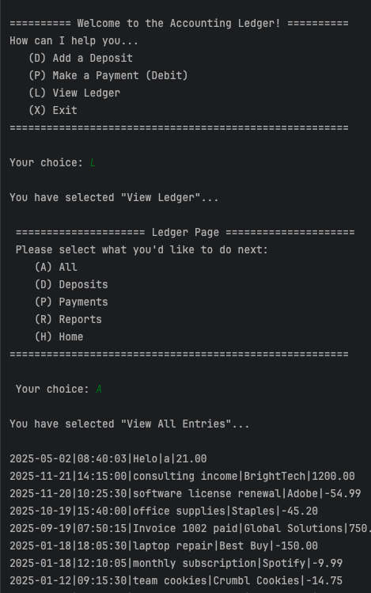

# Accounting Ledger App

A Java-based command-line tool that helps individuals or small businesses track and manage financial transactions. It allows users to record deposits and payments, view their full transaction history, and generate detailed reports—all saved to and read from a structured CSV file.

## Features

- ✅ Home Menu
    -  Add Deposit
    - Make Payment (Debit)
    - View Ledger
- ✅ Ledger View
    - View All transactions (newest first)
    - View only Deposits
    - View only Payments
- ✅ Reports Menu
    - Month-To-Date
    - Previous Month
    - Year-To-Date
    - Previous Year
    - Search by Vendor
    - Custom Search
## Technologies Used

- Java
- Java I/O for reading/writing CSV
- Java Time API
- Git & GitHub for version control
- CLI-based UI
## Screenshots

